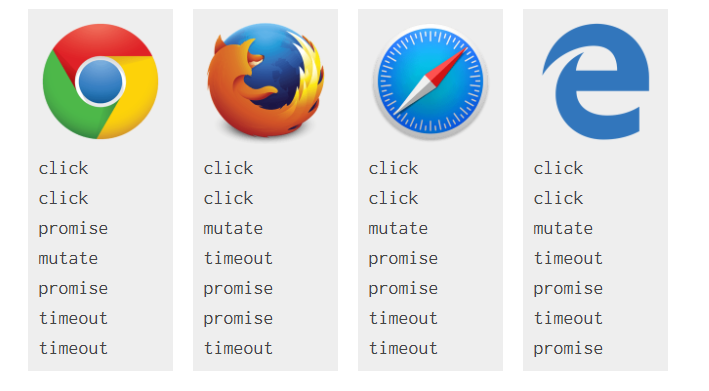

当我告诉我的同事Matt Gaunt我想写一篇关于微任务 队列和在浏览器事件循环中执行的文章时，  他说；我实话跟你说Jake我是不会去看的。 好吧，无论如何我已经写下来了，所以我们都要坐下来享受这篇文章， 好吗 ？

如果你更喜欢视频，Philip Roberts在JSConf上关于事件循环有一个很棒的演讲 --不包括微任务， 但是很好的介绍了其他部分。不管怎样，精彩继续...

看看这段JavaScript代码：

```javascript

console.log('script start');

setTimeout(function() {
  console.log('setTimeout');
}, 0);

Promise.resolve().then(function() {
  console.log('promise1');
}).then(function() {
  console.log('promise2');
});

console.log('script end');

```
控制台上会以什么顺序出现呢？

##可以打开控制台试一下

正确答案是：
```javascript

script start
script end
promise1
promise2
setTimeout

```
但就浏览器支持而言，它是相当疯狂的

Microsofe Edge，Firefox 40，IOS Safari和桌面Safari 8.0.8在promise1和promise2之前打印setTimeout - 尽管这看起来像是一个竞争条件，这真的很奇怪，因为在Firefox39和Safari 8.0.7上始终是正确的

##为什么会这样？

理解这一点你要知道事件循环是如何处理任务和微任务，当你第一次遇到它的时候，这可能会让你头脑清醒很多。深呼吸...

每个线程都有自己的事件循环，所以每个工作线程都有它自己的事件循环，它可以独立执行，而同一起点上的所有窗口共享一个事件循环，因为它们可以同步通讯，事件循环持续运行，执行任何队列里的任务，一个事件循环有多个任务源，这些任务源保证了该源内的执行顺序(比如IndexedDB这样的规范定义它们自己的任务源)，但是浏览器可以在每次循环中选择从那个源执行任务。这允许浏览器优先选择性能敏感的任务，比如用户输入。

任务被放到任务源，这样浏览器就可以从内部访问Javascript/Dom，并确保这些操作按顺序进行。任务之间，浏览器可能会重新渲染，从鼠标点击事件到事件回调需要调度一个任务，解析HTML也是一样的，在上面的例子中setTimeout也一样。

setTimeout等待给定的延迟，然后为其回调安排一个新的任务，这就是为什么setTimeout在script end之后打印，scripe end在第一个任务内，setTimeout被记录在单独的一个任务中，好了，我们快讲完了，但是我需要你为剩下这一点坚持下...

微任务通常是为当前执行脚本结束后应该立即发生的事情，例如对一批动作作出反应，或者在不承担整个新任务的代价下进行异步，只要没有其他javascript在执行中，微任务队列就会在回调之后处理，在每个任务结束的时候。在微任务期间排队的任何其他微任务都被添加到队列的末尾并进行处理。微任务包括`mutation observer callbacks`，上面的例子中的`promise`的`callbacks`。

一个settles状态的promise，或者已经变成settled状态，它会将callback放到微任务队列里。这确保promise的回调是异步的即使promise已经变成settled状态。因此对已settled状态的promise调用`.then()`会立即把一个微任务添加到微任务队列。这就是为什么`script end`结束后打印`promise1`和`promise2`，因为当前运行的脚本必须在处理微任务之前完成。在setTimeout之前打印promise1和promise2，因为微任务总是在下一个任务之前发生。

okay 一步一步运行

```javascript

console.log('script start');

setTimeout(function() {
  console.log('setTimeout');
}, 0);

Promise.resolve().then(function() {
  console.log('promise1');
}).then(function() {
  console.log('promise2');
});

```

没错上面的解释是对的，我创建一个step-by-step动画图解(`这个原文有个动画可以一步一步点击运行js代码，可以点下方原文地址进行访问操作`)。你星期六过得怎么样？和你的朋友一起出去玩？我没有。(`反正我的休息日除了学习就是看电影`)如果我的UI设计不够清晰，点击上方箭头运行代码。

##有些浏览器有什么不同之处？

有些浏览器打印`script start`，`script end`，`setTimeout`，`promise1`，`promise2`。他们在setTimeout之后运行promise回调。很可能他们调用promise回调是作为新任务的一部分而不是作为微任务。

这多少情有可原，因为promises来自ECMAScript而不是HTML。ECMAScript的工作原理类似于微任务，但除了邮件列表讨论含糊不清之外，这种关系并不明确。不管怎样，一般的共识是promises应该是微任务队列的一部分。这是有充分理由的。

将promises作为任务会导致性能问题，由于回调函数可能会被任务相关的事例如渲染而延迟执行。与其他任务源交互时会产生不确定性，也会打断其他api的交互，不过稍后在细说。

提交了一条Edge反馈，它将promises当作microtasks使用。WebKit每晚都在做正确的事情，所以我认为Safari最终会解决这个问题，Firefox43似乎已经修复这个问题了。

有趣的是Safsri和Firefox都发生了退化，而之前版本是对的。我在想这是不是巧合。

##怎么判断一个东西是使用任务还是微任务

测试是一种方法。查看相对于promises和setTimeout如何打印，尽管你依赖于实现是否正确的。

有一种确定的方式就是查阅规范。举个例子，将一个任务加入队列[step 14 of setTimeout](https://html.spec.whatwg.org/multipage/timers-and-user-prompts.html#timer-initialisation-steps)，将一个微任务加入队列[step 5 of queuing a mutation record](https://dom.spec.whatwg.org/#queue-a-mutation-record)

如上所述，在ECMAScript里microtasks叫jobs，调用`EnqueueJob`将microtask添加到队列。[In step 8.a of PerformPromiseThen](http://www.ecma-international.org/ecma-262/6.0/#sec-performpromisethen)

现在，让我们看一个更复杂的例子。一个有心的学徒，他们还没准备好，别管他们了，你已经准备好了，让我们做这个...

##一级 boss对战

在写这篇文章之前我犯了一个错误，这里有一些html:
```html

<div class="outer">
  <div class="inner"></div>
</div>

```

给出一下js，如果我点击`div.inner`会打印出什么呢？

```javascript

// Let's get hold of those elements
var outer = document.querySelector('.outer');
var inner = document.querySelector('.inner');

// Let's listen for attribute changes on the
// outer element
new MutationObserver(function() {
  console.log('mutate');
}).observe(outer, {
  attributes: true
});

// Here's a click listener…
function onClick() {
  console.log('click');

  setTimeout(function() {
    console.log('timeout');
  }, 0);

  Promise.resolve().then(function() {
    console.log('promise');
  });

  outer.setAttribute('data-random', Math.random());
}

// …which we'll attach to both elements
inner.addEventListener('click', onClick);
outer.addEventListener('click', onClick);

```

继续，先试一试然后再看答案。提示：logs可能会发生多次。

##测试

点击内部方块触发点击事件

和你猜想的有什么不同吗？如果是这样，你可能仍然是对的。不幸的是这里的浏览器并不一致


##谁是对的？

触发点击事件是一个任务，Mutation observer和promise回调函数加入微任务队列。setTimeout回调函数加入任务队列。运行结果如下

chrome是对的，有一点对于我来说是新发现微任务是在回调之后处理的(只要没有其他JavaScript在运行种)，我认为它仅限于任务结束。这条规则来自HTML规范用于调用回调

...微任务检查点涉及到遍历微任务队列，除非我们已经在处理微任务队列。同样的，ECMAScript规范这么说：

`Execution of a Job can be initiated only when there is no running execution context and the execution context stack is empty…                               — ECMAScript: Jobs and Job Queues`

尽管"can be"在HTML上下文中变成了"must be"。

##浏览器那里出错了？

Firefox和Safari正确的在点击事件之间清空了微任务队列，如mutation回调，但promises的队列似乎有所不同。考虑到`jobs`和`microtasks`的联系是比较模糊的，这多少情有可原。但我仍然期待它们在监听回调之间执行。[Firefox ticket](https://bugzilla.mozilla.org/show_bug.cgi?id=1193394)。[Safari ticket](https://bugs.webkit.org/show_bug.cgi?id=147933)

对于Edge我们已经看到它的promises队列是错误的，它也无法在点击事件之间清空微任务队列，而是在调用所有点击回调之后才清空，这就解释了在两次点击之后打印出单个mutate。[Bug ticket](https://connect.microsoft.com/IE/feedbackdetail/view/1658386/microtasks-queues-should-be-processed-following-event-listeners)

##等级一打怪升级

使用上面的例子，如果我们运行的话会发生什么

```javascript

inner.click();

```

跟之前一样会触发click事件，但是这是使用的代码而不是真正的交互。

浏览器是这样说的：



我发誓我从chrome种得到了不同的结果，我已经把这个图表更新无数次了我以为我是在错误的测试`Canary`。如果你在chrome得到不同的结果，在评论里告诉我是那个版本的。

##为什么不同呢？

以下介绍了是如何发生的：

所以正确的顺序是：`click`，`click`，`promise`，`mutate`，`promise`，`timeout`，`timeout`，chrome似乎是对的。

在每个listener callback被调用之后...

以前，这意味着microtasks在listener callback之间运行，但是`click()`会导致事件的同步触发，因此调用`click()`的代码仍然在回调之间的堆栈中。上面的规则确保microtasks不中断正在执行过程中的Javascript。这意味着我们不会在listener callbacks中处理microtask队列，它们是在两个listeners之后处理的。

##这些重要吗？

重要，它会在你看不见的地方咬你(哎哟)。我在尝试为indexedDB创建一个简单的包装器库时遇到了这种情况，该库使用了promise而不是奇怪的IDBRequest的对象。它几乎使IDB使用起来很有趣。

当IDB成功触发一个事件时，相关的事务对象在触发之后变成非激活状态。如果我创建一个promise在事件被触发时resolces，当事务仍在活动时，回调应该运行在步骤四之前，但这在chrome以外浏览器是不会发生的，导致这个库有点无用。

实际上这个问题可以在Firefox上解决，因为promise polyfills比如es6-promise使用mutation observers执行回调，它正确地使用了微任务，Safari似乎因为这个修复而受到竞争条件的影响，但这可能只是它们对IDB的不完善实现。不幸的是，在IE/Edge不一致，因此mutation事件不在回调函数之后处理。

希望我们很快就能在这里看到一些互通性。

##你做到了！

总结：

    任务按顺序执行，浏览器可能在任务之间渲染
    微任务按顺序执行，被执行的：
      。每个回调之后，只要没有其他的代码在运行中
      。每个任务的末尾

希望你现在已经了解了事件循环的方法，或者至少找个借口出去走一走 躺一躺。

Actually, is anyone still reading ? hello? hello?

[原文地址](https://jakearchibald.com/2015/tasks-microtasks-queues-and-schedules/)